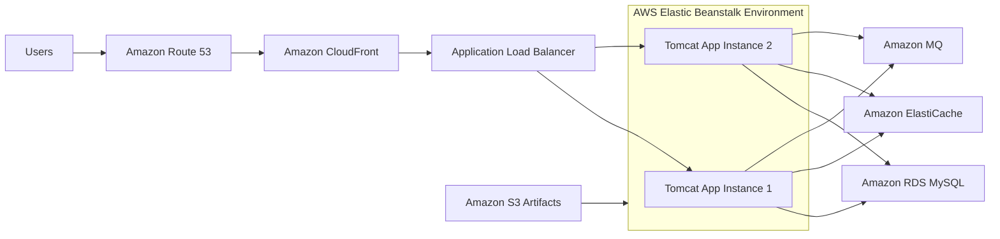
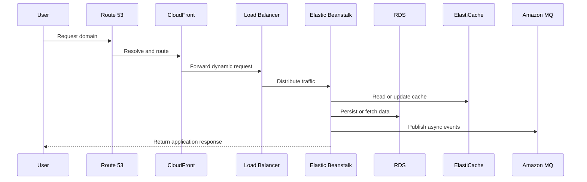

<div align="center">

# Cloud-NativeJava3TierDeployment

<p><strong>Java web application deployment on AWS with Elastic Beanstalk, managed services, CDN delivery, and scalable traffic handling.</strong></p>

[](https://www.oracle.com/java/technologies/javase/jdk17-archive-downloads.html)
[](https://spring.io/)
[](https://aws.amazon.com/)
[](https://aws.amazon.com/elasticbeanstalk/)
[](https://www.ansible.com/)
[](https://opensource.org/licenses/MIT)

</div>

---

## Overview

This project showcases a Java web application deployed on AWS using a cloud-native, multi-tier architecture. The application is hosted through **AWS Elastic Beanstalk**, fronted by an **Application Load Balancer**, and scaled with **Auto Scaling** for resilient traffic handling.

The stack integrates **Amazon RDS** for relational data, **Amazon ElastiCache** for low-latency caching, **Amazon MQ** for asynchronous messaging, and **Amazon S3** for artifact storage. **Amazon CloudFront** and **Amazon Route 53** improve DNS routing and content delivery performance.

## Highlights

> Deployed Java web application using AWS Elastic Beanstalk with load balancing and auto scaling.
>
> Integrated AWS services including RDS, ElastiCache, Amazon MQ, and S3.
>
> Improved performance using CloudFront CDN and Route 53 DNS.

## Architecture Diagram



## Request Flow



## Tech Stack

| Layer | Services / Tools |
| :--- | :--- |
| Application | Java 17, Spring MVC, Spring Security, Spring Data JPA |
| Packaging | Maven WAR build |
| Compute Platform | AWS Elastic Beanstalk |
| Traffic Management | Application Load Balancer, Auto Scaling |
| Database | Amazon RDS MySQL |
| Cache | Amazon ElastiCache |
| Messaging | Amazon MQ |
| Storage | Amazon S3 |
| Delivery | Amazon CloudFront |
| DNS | Amazon Route 53 |
| Automation | Ansible |
| View Layer | JSP, JSTL |

## Why This Architecture

- **Elastic Beanstalk** simplifies deployment, environment provisioning, and health management.
- **Load Balancer + Auto Scaling** improve availability under variable traffic.
- **RDS** offloads database operations to a managed service.
- **ElastiCache** reduces database pressure and improves response times.
- **Amazon MQ** decouples application workflows.
- **S3 + CloudFront** improve artifact management and delivery performance.
- **Route 53** provides reliable DNS routing for the application entry point.

## Project Structure

```text
ansible/                    # Provisioning and deployment support
src/
  main/java                 # Controllers, services, repositories, business logic
  main/resources            # application.properties, SQL dump, app resources
  main/webapp               # JSP pages and static frontend assets
pom.xml                     # Maven build configuration
README.md                   # Main project documentation
```

## Deployment Flow

1. Build the application into a WAR with Maven.
2. Store the deployment artifact in Amazon S3.
3. Create or update an Elastic Beanstalk application version.
4. Deploy to the Elastic Beanstalk environment.
5. Route production traffic through CloudFront and Route 53.

## Local Build

```bash
mvn clean install
```

## Configuration

Runtime settings are managed in `src/main/resources/application.properties`, including:

- JDBC database connectivity
- Cache host configuration
- Messaging broker configuration
- Spring MVC and security settings

## License

Distributed under the MIT License.

Copyright (c) 2025 Aman Pushp
