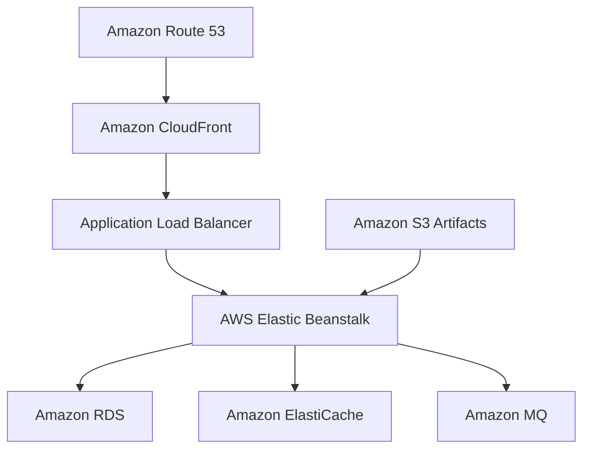

<div align="center">

# Cloud-NativeJava3TierDeployment

<p><strong>Ansible automation support for the AWS deployment workflow.</strong></p>

[](https://aws.amazon.com/)
[](https://www.ansible.com/)
[](https://opensource.org/licenses/MIT)

</div>

---

## Overview

This directory contains Ansible assets used to support deployment and environment preparation for the main AWS-based Java application architecture.

The wider platform is centered on **AWS Elastic Beanstalk**, **Application Load Balancer**, and **Auto Scaling**, with supporting services including **Amazon RDS**, **Amazon ElastiCache**, **Amazon MQ**, **Amazon S3**, **Amazon CloudFront**, and **Amazon Route 53**.

## Deployment Summary

> Deployed Java web application using AWS Elastic Beanstalk with load balancing and auto scaling.
>
> Integrated AWS services including RDS, ElastiCache, Amazon MQ, and S3.
>
> Improved performance using CloudFront CDN and Route 53 DNS.

## Infra View



## Ansible Scope

- Prepare or configure supporting hosts and services where manual setup is undesirable.
- Standardize repeatable deployment-related operations.
- Keep infrastructure and environment steps automatable and version controlled.

## Files

```text
tomcat_setup.yml            # Tomcat-related setup automation
vpro-app-setup.yml          # Application deployment support
```

## Configuration Notes

Application settings are primarily defined in `src/main/resources/application.properties`, including:

- Database connectivity
- Cache endpoint configuration
- Messaging broker configuration
- Spring application settings

## License

Distributed under the MIT License.
